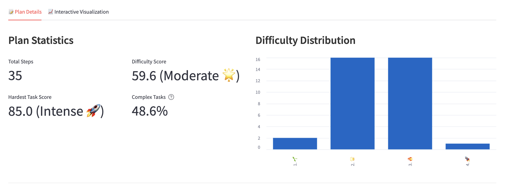

# HieraPlan - Hierarchical Task Planner

> 🚀 **[Try HieraPlan Demo](https://hieraplan.streamlit.app/)** - Generate your hierarchical task plan now!

A sophisticated planning system that generates detailed, hierarchical task plans using Large Language Models and Hierarchical Task Network (HTN) algorithms. All plans are exported in Markdown format, making them perfectly compatible with tools like Notion, Obsidian, and other markdown editors.

## Overview



Hierarchical Task Planner is a powerful tool designed to transform high-level requests into detailed, executable plans. By leveraging the reasoning capabilities of Large Language Models (LLMs) and the structured approach of Hierarchical Task Network (HTN) algorithms, this system provides quantitative task decomposition with complexity-based weighting.

### Interactive Visualization


### Key Features

- **Dynamic Plan Generation**: Creates 5-10 high-level steps based on request complexity
- **Weighted Task Analysis**: Assigns complexity weights (0-100%) to each step
  - 0-30%: Simple tasks requiring minimal effort
  - 31-70%: Moderate complexity tasks
  - 71-100%: Complex tasks requiring significant effort or expertise
- **Hierarchical Decomposition**: Breaks down complex tasks using HTN algorithms
- **Threshold-Based Refinement**: Recursively decomposes tasks until optimal granularity is achieved
- **Batch Processing**: Optimizes LLM calls by processing multiple tasks simultaneously
- **Multiple Export Formats**: Exports plans in Markdown, Text, or JSON formats

## Installation

### Prerequisites

- Python 3.8 or higher
- OpenAI API key

### Setup

1. Clone the repository:
```bash
git clone https://github.com/Zio-94/HieraPlan.git
cd HieraPlan
```

2. Create and activate a virtual environment:
```bash
python -m venv venv
source venv/bin/activate  # On Windows, use: venv\Scripts\activate
```

3. Install required packages:
```bash
pip install -r requirements.txt
```

## Usage
### Command Line Interface
Run the planner from command line:

```bash
python app/main.py
```

### Interactive Visualization
Launch the Streamlit interface for interactive planning and visualization:

```bash
python -m streamlit run app/visualization/app.py
```
